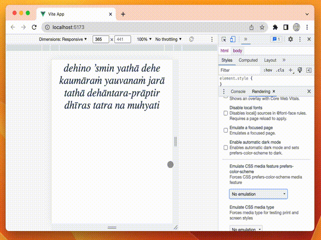

# vue-fit-text

This repository contains a text fitting component that utilizes SVG (Scalable Vector Graphics) to dynamically adjust the size of text to fit within a designated area.



```vue
<VueFitText
    :lines="['line1', 'line2']"
/>
```